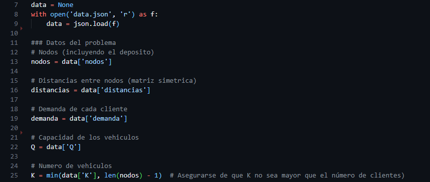

<style>
    .line{
        width: 100%;
        height: 1px;
        background-color: red;
        margin-top: -20px;
    }
</style>


## Definición del Problema
<div class="line"></div>

#### Descripción:
Una pequeña empresa de logística quiere optimizar sus rutas de entrega para reducir costos y mejorar la eficiencia. La empresa cuenta con varios vehículos y una lista de clientes que deben ser atendidos diariamente. Cada cliente tiene una demanda específica de productos, y los vehículos tienen una capacidad máxima. Además, existe una ventana de tiempo durante la cual las entregas deben ser realizadas.

## Pasos del Proyecto:

#### Formulación del Problema:
- Definir las variables de decisión (por ejemplo, $x_{ij}$ que indica si el vehículo viaja del punto $i$ al punto j.

- Establecer la función objetivo que se va a minimizar, que puede ser el costo total de las rutas (suma de las distancias recorridas).
Plantear las restricciones del problema, como la capacidad de los vehículos y las ventanas de tiempo para las entregas.

#### Aplicación del Método Simplex:
- Formular el problema en su forma estándar para aplicar el método simplex.
- Resolver el problema usando el método simplex para obtener la ruta óptima.

#### Método de las Dos Fases:
- Utilizar el método de las dos fases si el problema no está inicialmente en forma estándar (por ejemplo, si hay restricciones de igualdad que no pueden ser directamente manejadas por el simplex).
**Primera fase**: Encontrar una solución factible inicial.
**Segunda fase**: Optimizar la solución encontrada en la primera fase.

#### Análisis del Espacio Dual:
- Formular el problema dual del problema de optimización de rutas.
- Resolver el problema dual para obtener información adicional, como el precio sombra de las restricciones.
- Interpretar los resultados del problema dual en el contexto del problema original.

#### Uso del Método Ramificación y Acotación:
- Dado que resolver el modelo directamente por enumeración de todas las posibles rutas sería impracticable debido al alto costo computacional, se puede utilizar el método de Ramificación y Acotación para dividir el problema en subproblemas más manejables, acotar las soluciones subóptimas y explorar eficientemente el espacio de soluciones

#### Implementación Computacional:
=> Implementar el modelo matemático utilizando un software de optimización como Python 

=> Validar los resultados obtenidos y realizar análisis de sensibilidad para ver cómo cambian las soluciones óptimas con diferentes parámetros.


## Modelo Matemático y Solución
<div class="line"></div>

### Introducción
El problema abordado en este proyecto es un caso típico de optimización conocido como Vehicle Routing Problem (VRP) con capacidad limitada y ventanas de tiempo, una variante del clásico problema de optimización de rutas. Este modelo busca minimizar el costo total de distribución, considerando restricciones como la capacidad de los vehículos, la demanda de los clientes, y el cumplimiento de ventanas de tiempo. La importancia de este modelo radica en su aplicabilidad a escenarios de logística y distribución, donde es necesario determinar rutas óptimas para minimizar costos y tiempos de entrega.

### Definición del Modelo
**Objetivo**: Minimizar el costo total de las rutas para todos los vehículos utilizados, lo cual se traduce en minimizar la suma de las distancias recorridas por los vehículos en su recorrido entre el depósito y los clientes.

**Variables de Decisión:**

- $x_{ij}^k$ : Variable binaria que indica si el vehículo $k$ viaja del punto $i$ al punto $j$. Toma el valor 1 si el viaje se realiza, y 0 en caso contrario.
$$x_{ij}^k  = \left\{ \begin{array}{ll}
    1 & \text{si el vehículo } k \text{ viaja del punto } i \text{ al punto } j \\
    x+1 & \text{en otro caso}
\end{array} \right.$$
- $u_i^k$ : Variable continua que representa la posición del cliente $i$ en la ruta del vehículo $k$. Se utiliza para evitar la formación de subciclos. Puede suceder que al optimizar las rutas, los vehículos formen subciclos que no incluyan al depósito. Un subciclo es una ruta cerrada en la que un vehículo visita solo un subconjunto de los clientes y no vuelve al depósito, lo cual no es deseable, ya que cada vehículo debe regresar al depósito después de completar su ruta. El desafío es evitar que estos subciclos se formen en la solución del problema. Esto simplemente es una herramienta computacional para evitar este problema dentro de la solución.

**Datos del Problema:**
Los datos del problema incluyen:

- **Clientes y Depósito** ($N$): Representados por el depósito ($0$) y los clientes ($1,2,…,n$).
- **Distancias** ($d_{ij}$): Matriz de distancias entre cada par de nodos, donde $i$ y $j$ pueden ser el depósito o cualquiera de los clientes.
- **Demanda** ($q_i$): Demanda de cada cliente $i$.
- **Capacidad** ($Q$): Capacidad máxima de carga que puede transportar cada vehículo.
- **Ventanas de tiempo** ([$e_i, l_i$]): Intervalo de tiempo en el cual el cliente $i$ debe ser atendido.

- **Número de Vehículos** ($K$): Número de vehículos disponibles.

## Formulación Matemática del Modelo
#### Función Objetivo:

$$Minimizar \sum_{k\in K}\sum_{i\in N}\sum_{j\in N}d_{ij}\cdot x_{ij}^k$$
 
> La función objetivo busca minimizar la distancia total recorrida por todos los vehículos, lo que se traduce en la suma de las distancias recorridas por cada vehículo entre los diferentes puntos del problema.

#### Restricciones:
1) **Visita Única**: Cada cliente debe ser visitado exactamente una vez por algún vehículo.
$$\sum_{k\in K}\sum_{j\in N}x_{ij}^k=1 \quad \forall i\in Clientes$$
2) **Salida del Depósito**: Cada vehículo debe salir del depósito exactamente una vez.
$$\sum_{j\in Clientes}x_{0j}^k=1 \quad \forall k\in K$$
3) **Retorno al Depósito**: Cada vehículo debe regresar al depósito después de completar su ruta.
$$\sum_{i\in Clientes}x_{i0}^k=1 \quad \forall k\in K$$

4) **Flujo de Vehículos**: Asegura que cada vez que un vehículo llega a un cliente, sale de él.
$$\sum_{j\in N}x_{ij}^k=\sum_{j\in N}x_{ji}^k \quad \forall i\in Clientes, \forall k\in K$$
5) **Capacidad de los Vehículos**: La carga transportada por un vehículo en cada ruta no puede superar su capacidad.
$$\sum_{i\in Clientes}q_i\cdot x_{ij}^k\leq Q \quad \forall k\in K$$
6) **Eliminación de Subciclos**: Se utiliza la variable $u$ para evitar la formación de subciclos.
$$u_i^k-u_j^k+Q\cdot x_{ij}^k\leq Q-q_j \quad \forall i,j\in Clientes, \forall k\in K$$
7) **Ventanas de Tiempo**: Las visitas a los clientes deben respetar sus ventanas de tiempo. Esto se puede simplificar integrando las ventanas en el cálculo de las distancias o los costos.

#### Detalles de Implementación
La implementación de este modelo se realizó utilizando Python, usando la biblioteca `PuLP`. Los detalles de los datos se manejan en un archivo `JSON` que contiene las distancias entre nodos, la demanda de cada cliente, la capacidad de los vehículos y otros parámetros relevantes​(data).

**Lectura de Datos**: Los datos del problema, como las distancias y la demanda, se almacenan en un archivo JSON (`data.json`) que se lee al iniciar el programa. Esto facilita la modificación de los datos y hace el modelo más flexible. Este archivo debe estar en la carpeta del proyecto.

**Modelado del Problema**: Se define el problema de optimización con `LpProblem` y las variables $x_{ij}^k$ y $u_i^k$ se definen como variables de decisión binarias y continua, respectivamente. Esto asegura la formulación precisa de las restricciones.

**Restricciones**: Las restricciones se codifican directamente en el modelo usando las funciones proporcionadas por `PuLP` para asegurarse de que cada cliente es atendido, que se respetan las capacidades de los vehículos y que se evitan subciclos.

**Optimización**: Una vez definido el modelo con todas sus restricciones y la función objetivo, se ejecuta el solver para encontrar la solución óptima, minimizando el costo total de las rutas.

#### Detalles importantes
**Uso de Variables Binarias**: Las variables $x_{ij}^k$ se definen como binarias para garantizar que un vehículo viaje o no entre dos puntos, lo cual facilita la formulación del problema y la interpretación de los resultados.

**Uso de Variables Continuas**: Las variables $u_i^k$ se definen como variables continuas para representar la posición de los clientes en las rutas de los vehículos. Esto permite la formulación de restricciones que evitan la formación de subciclos. Esta técnica es usada para evitar la formación de subciclos en problemas de ruteo, lo que garantiza que las rutas de los vehículos no sean fragmentadas y todos los nodos sean visitados de manera continua.

**Integración de Ventanas de Tiempo en las Distancias**: Esto simplifica la implementación al evitar la necesidad de introducir variables adicionales para el tiempo de inicio de servicio, haciendo que el problema sea más manejable sin perder precisión en la representación de las restricciones temporales.

## Resultados Esperados y Conclusión
Con la implementación adecuada de este modelo, se espera obtener rutas óptimas para la distribución de bienes, respetando las capacidades de los vehículos y minimizando la distancia total recorrida. El modelo es flexible y puede ajustarse a diferentes tamaños de problemas modificando los datos de entrada. Esto lo convierte en una herramienta poderosa para problemas de logística y transporte.

El enfoque propuesto busca equilibrar la complejidad teórica del problema con una implementación práctica, utilizando herramientas de optimización lineal que facilitan la resolución de problemas complejos y brindan soluciones eficientes.


## Como ejecutar el programa
1. Asegúrese de tener Python 3 o superior (Ejemplo: Python 3.9.2) instalado en su sistema.
2. Instale las dependencias necesarias ejecutando el siguiente comando: pip install -r requirements.txt
3. Ejecute el programa con el siguiente comando: python main.py
4. El programa leerá los datos del archivo data.json y generará una solución óptima para el problema de ruteo de vehículos.
5. Los resultados se graficaran con el modulo matplotlib, graficando las rutas de los vehículos intuitivamente.

***Nota 1***: Es importante que el archivo data.json se encuentre en la misma carpeta que el archivo main.py para que el programa pueda leer los datos correctamente.
***Nota 2***: También es importante que el archivo data.json tenga la estructura correcta, de lo contrario el programa no podrá leer los datos correctamente.
***Nota 3***: Se desconectó la aplicación de Ramificación y acotación ya que la ejecución de dicho enfoque es demasiado lenta, pero se encuentra implementado en el código. Si se desea ejecutar el enfoque de Ramificación y acotación, se debe descomentar la línea `316` del archivo main.py.
***Nota 4***: Para cambiar los datos del problema, se debe modificar el archivo data.json.
***Nota 5***: Los datos en el archivo data.json deben estar consistentes. Por ejemplo, la matriz de distancias debe ser simétrica, también la cantidad de clientes debe ser igual a la cantidad de demandas e igual a cada dimensión de la matrz distancias, la capacidad de los vehículos debe ser mayor a la demanda máxima, los vehículos deben ser capaces de suministrar la demanda, lo cual significa que $Q \cdot K \ge \sum_{i \in Clientes} demanda_i$. La cantidad de vehículos debe ser menor que la cantidad de clientes.
***Nota 6***: El programa no verifica que todos los datos sean consistentes, solo algunos, por lo que se debe verificar que los datos sean consistentes antes de ejecutar el programa.
***Nota 7***: El archivo `entradas.py` contiene una forma mas simplificada de generar datos para la entrada del modelo, esto en caso de querer generar datos cambiando facilmente las entradas y compilando este archivo, el cual regenará nuevamente un archivo data.json con los datos generados(sobrescribiéndolo).


# Citas del código
- 
Aqui se extraen los datos del archivo data.json y se los guarda en variables para su posterior uso.
<div class="line" style="margin: 15px 0px"></div>

- 
Declaración de variables de decisión y función objetivo.
Se definen las variables de decisión $x_{ij}^k$. Estas son variables binarias que indican si el vehículo $k$ viaja del nodo $i$ al nodo $j$. Obviamente no se definen las variables $x_{ij}^k$ para los $i$ y $j$ iguales, excluyendo los viajes de un nodo a si mismo.
<div class="line" style="margin: 15px 0px"></div>

- 
Declaración de restricciones en formato particular para pasarselo a la librería `pulp`.
<div class="line" style="margin: 15px 0px"></div>

- 
Se resuelve el modelo con la librería `pulp`.
<div class="line" style="margin: 15px 0px"></div>

- 
Se relaja el modelo, que implica se eliminen las restricciones de las variables enteras haciendo que las $x_{ij}$ romen valores reales entre 0 y 1.
<div class="line" style="margin: 15px 0px"></div>

- 
Implementación del método de ramificación y acotación. Se comprueba si las soluciones ofrecidas por el método simplex son enteras, si no lo son, se ramifica el problema en dos subproblemas, uno con la variable $x_{ij}$ igual a 0 y otro con la variable $x_{ij}$ igual a 1.
<div class="line" style="margin: 15px 0px"></div>

- 
Implementación del método de las dos fases. En la primera fase se relaja el modelo y se busca una solución factible. En la segunda fase se relaja el modelo y se busca una solución óptima.
Se introducen variables artificiales $a_{ij}^k$. Estas variables ayudan a encontrar una solución factible inicial. Cada $a_{ij}^k$ representa una variable que se añade para "forzar" el cumplimiento de las restricciones si no es posible cumplirlas con las variables $x_{ij}^k$.
<div class="line" style="margin: 15px 0px"></div>

- 
Se realizan dos tareas principales relacionadas con el análisis de la solución de un modelo de optimización lineal: el análisis del espacio dual mediante la revisión de los precios sombra y un análisis de sensibilidad, evaluando el impacto de cambios en los parámetros del problema (como la demanda de un cliente).
Mostrar los precios sombra permite entender cómo de "ajustada" está cada restricción en el modelo. Si un precio sombra es positivo, indica que la restricción es activa y que incrementar su valor relajaría el problema, mejorando el valor de la función objetivo.
Este análisis es clave para identificar qué restricciones limitan el valor óptimo de la función objetivo y cómo se podría mejorar la solución mediante ajustes en los recursos disponibles.
Analisis de Sensibilidad:
En este caso, se modifica la constante de una restricción que representa la demanda del cliente 1:
```python
modelo.constraints["Visita_unica_1"].constant += 1
```
Esto incrementa en 1 la demanda del cliente 1. Esto puede significar, por ejemplo, que el cliente 1 necesita recibir un pedido adicional. Esto implica un ajuste en la restricción que asegura que el cliente 1 sea visitado una vez, posiblemente aumentando la carga total que debe manejar un vehículo para satisfacer dicha demanda.
Se vuelve a resolver el modelo con la nueva restricción y se obtienen los nuevos precios sombra.

<div class="line" style="margin: 15px 0px"></div>

- 
Se Visualizan los datos con los recorridos de los vehículos. Se realiza mediante la librería `matplotlib`.


